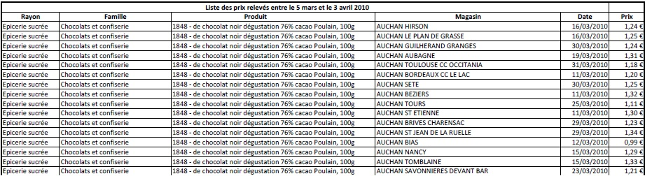

# QLMC 2007-2012 data prep

This repository contains the code used to extract and clean supermarket price records from large pdf files made available by the comparison website quiestlemoinscher.com. Below are provided a description of the data and an overview of the scripts contained in this repository.

--------------------

## Data

### Overview of pdf files

Each file contains price records collected over a short period of time in order to perform aggregate price comparisons. A (slightly edited) screenshot:

The following table lists the pdf files and provides some details such as the order of the records (variable name translations are provided in the next section), the number of rows an price range. Price ranges reveal some issues which are discussed in a following section.

|P  | File name                 |  Date start |    Date end |  Nb rows | Price range   | Ordered by                    |
|---|:--------------------------|-------------|-------------|----------|---------------|-------------------------------|
|0  | 200705\_releves\_QLMC.pdf |  09/05/2007 |  25/05/2007 |  554,691 | [0.28; 45.99] | Rayon Famille Produit Magasin |
|1  | 200708\_releves\_QLMC.pdf |  10/08/2007 |  31/08/2007 |  570,193 | [0.25; 26.95] | Rayon Famille Produit Magasin |
|2  | 200801\_releves\_QLMC.pdf |  21/01/2008 |  12/02/2008 |  544,366 | [0.15; 31.52] | Rayon Famille Produit Magasin |
|3  | 200804\_releves\_QLMC.pdf |  04/04/2008 |  30/04/2008 |  417,272 | [0.16; 28.38] | Rayon Famille Produit Magasin |
|4  | 200903\_releves\_QLMC.pdf |  01/04/2009 |  30/04/2009 |  414,911 | [0.36; 22.23] | No order                      |
|5  | 200909\_releves\_QLMC.pdf |  01/09/2009 |  28/09/2009 |  432,510 | [0.30; 31.46] | Magasin Produit               |
|6  | 201003\_releves\_QLMC.pdf |  05/03/2010 |  03/04/2010 |  446,309 | [0.30; 09.99] | Produit Magasin (Chaine)      |
|7  | 201010\_releves\_QLMC.pdf |  18/10/2010 |  16/11/2010 |  385,253 | [1.00; 99.00] | Rayon Famille Produit Magasin |
|8  | 201101\_releves\_QLMC.pdf |  28/01/2011 |  22/02/2011 |  357,188 | [0.37; 09.99] | Rayon                         |
|9  | 201104\_releves\_QLMC.pdf |  28/04/2011 |  20/05/2011 |  240,710 | [0.31; 09.99] | Produit                       |
|10 | 201110\_releves\_QLMC.pdf |  17/10/2011 |  09/11/2011 |  430,968 | [0.16; 35.02] | Rayon Famille Produit         |
|11 | 201201\_releves\_QLMC.pdf |  30/01/2011 |  22/02/2011 |  464,604 | [0.15; 34.99] | Rayon Famille Produit         |
|12 | 201206\_releves\_QLMC.pdf |  12/05/2012 |  01/06/2012 |  607,185 | [0.16; 29.14] | Rayon Famille Produit         |

### Variables in pdf files

Each pdf file includes the following variables (the variable name in english, that will be used thereafter, is indicated in parentheses):
- "Magasin" (store\_id) is the name of the store, basically composed by the store chain and its municipality. It may include some information to all disambiguations for cities sheltering several stores of the same chain
- "Produit" (product) is the full product name, including its brand and its format/size
- "Rayon" (section) indicates the product section (e.g. Drinks)
- "Famille" (family) indicates the product family (e.g. Water)
- "Price" (price) indicates the product price (total price in euros)
- "Date" (date) indicates the date of the price record

Within each period, a product is uniquely associated with a section and a family. Each family is a subcategory of a section.  There are some variations in the section/family labels across periods (todo: add more info).

### Added Variables

- store\_id is used to generate two variables: store\_chain (retail grocery chain) and store municipality (which may not exactly correspond to a municipality name as previously explained)
- store\_municipality is used to create the variable c\_insee which contains a code identifying the store municipality (used by the French National Institute of Statistics)
- store\_chain and c\_insee are used to match stores with a database of french grocery stores produced by LSA. The variable id\_lsa indicates the id defined by LSA for each store successfully matched. It can be empty when no match was found (rare) or when there were several candidates (more frequent).
- product is used to generate three variables: product\_brand, product\_label and product\_format.

### Overview of stores and products by period

The following table provides an overview of extracted data in terms of number of stores and number of products by period. Importantly, the sample of stores tends to vary significantly over time. There are less variations in products included but the same product can be labelled in slightly different ways across periods.

|  P | File name                 |  Nb stores |  Nb products |  Avg nb prod/store |
|----|:--------------------------|------------|--------------|--------------------|
|  0 | 200705\_releves\_QLMC.pdf |        344 |        2,325 |       1,612        |
|  1 | 200708\_releves\_QLMC.pdf |        335 |        2,384 |       1,702        | 
|  2 | 200801\_releves\_QLMC.pdf |        318 |        2,374 |       1,712        | 
|  3 | 200804\_releves\_QLMC.pdf |        246 |        2,443 |       1,696        | 
|  4 | 200903\_releves\_QLMC.pdf |        701 |        1,471 |         592        | 
|  5 | 200909\_releves\_QLMC.pdf |        726 |        1,463 |         596        | 
|  6 | 201003\_releves\_QLMC.pdf |        739 |        1,466 |         604        | 
|  7 | 201010\_releves\_QLMC.pdf |        624 |        1,479 |         617        | 
|  8 | 201101\_releves\_QLMC.pdf |        634 |        1,383 |         563        | 
|  9 | 201104\_releves\_QLMC.pdf |        637 |          954 |         378        | 
| 10 | 201110\_releves\_QLMC.pdf |        640 |        1,674 |         673        | 
| 11 | 201201\_releves\_QLMC.pdf |        617 |        1,657 |         753        | 
| 12 | 201206\_releves\_QLMC.pdf |        605 |        1,805 |       1,004        | 

### Data issues and remedies

Regarding prices:

- Period 6: it can be observed that all prices above 10.00 euros have been divided by 10 (hence min price for "Ricard pastis 45 degrés 50cl" is 1.00 euros. Since only two digits are provided after decimal point, this induces a loss in information. Furthermore, there is no general trivial fix based on spread as there are products for which all prices are above 10 euros (e.g. "Ricard pastis 45 degrés 70cl"). One way to correct the data is to compare average price across periods whenever the product is part of another record. However, after multiplication by 10, prices can not be compared directly with other periods' prices due to the loss of one digit. One may thus want to set affected prices to missing values.
- Period 7:  it can observed that all prices below 1.00 euro have been multiplied by 100. It appears that the real highest price product within the period is "Mumm Cordon rouge champagne brut 75cl", the price of which does not exceed 35 euros so a simple fix consists in dividing all prices above that level by 100. The products thereby affected have been checked to ensure this strategy was valid (in the last resort, one could have proceeded to inter period comparisons).
- Period 8: same issue as in period 6
- Period 9: same issue as in period 7

Some stores can not be matched with the LSA French store database, generally because there is more than one store of a given chain in a given municipality, and information provided in the pdf data does not allow a disambiguation. Though the sample of stores varies significantly across periods many stores are observed several times. In two different periods, a given store can be recorded under two different store\_id, hence id_lsa is to be used for any dynamic analysis.

Regarding products, product labels often exhibit slight wording differences across periods, thus requiring some treatment to allow for inter-period comparisons.

-------------------

## Scripts (Coming soon)

This section provides a brief overview of the code used to extract and clean the data
