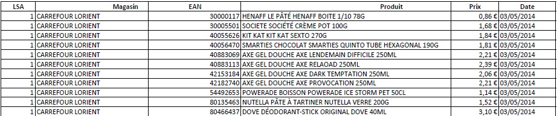

# QLMC 2014-15 data prep

This repository contains the code used to collect and clean price data from the price comparison website ([quiestlemoinscher.com](http://www.quiestlemoinscher.com/)) for the period 2014-2015.

----------

## Scripts

### read_pdfs

Two scripts which extact and clean price records from large pdf files, dating back to May and September 2014, downloaded from the website. A (slightly edited) screenshot:

### scraping_201503

Scripts used to scrap the website in March 2015:

- scrap_leclerc_stores : fetches leclerc store identifiers by region and saves them in dict_reg_leclerc_stores.json (dictionary keys are regions).
- scrap_leclerc_competitors : fetches leclerc competitor identifiers of each leclerc store and saves them in dict_leclerc_comp.json (dictionary keys are leclerc store identifiers).
- scrap_all_comparisons: fetches price comparisons (i.e. prices of both stores through a double loop: each competitor of each leclerc store. However, in order to minimize the number of queries, price comparisons of pairs composed by stores which have already been collected previously (as parts of other pairs) are not fetched. This implies that scraped data obtained are (most likely) a subset of the data collected by Leclerc. Price comparisons are stored in one dictionary by region (e.g. dict_reg_comparisons_alsace.json ).
- check_pairs_not_scraped: provides a list of pairs not scraped (as a result of the minimization of scraping queries)

### build_qlmc_data

Scripts used to clean and enrich scrapped data, then to merge them with data extracted from pdf files. Figures at the beginning of each script name indicate the order in which they are to be read/executed.

- 0_build_df_prices: loops on dictionaries containing price comparisons and to generate one dataframe containing all scraped prices.
- 0_build_df_qlmc_competitors: generates one dataframe listing all store price comparisons proposed on the website in March 2015 (including stores gps coordinates), as well as the result of the comparison (number of products compared, percent difference in aggregate prices) for the pairs which were scraped
- 0_build_df_stores: builds a dataframe with store information
- 1_get_store_insee_area: adds insee codes to store information
- 2_get_store_lsa_id: adds LSA ids to store information, which allows to enrich store information with data purchased from LSA
- 3_build_df_qlmc: builds a dataframe containing all scraped data
- 3_build_df_pairs: builds a dataframe which lists all pairs of stores (for which price records are available) separated by a distance of less than 25 km as the crow flies
- 3_get_qlmc_competitor_travel_time.py: fetches the travel time (using the Google Maps Directions API)  between all pairs of stores compared on the website in March 2015
- 4_build_df_qlmc_2014_2015.py: merges 2014 and 2015 data
- 5_build_df_pairs_2014_2015.py: builds a dataframe which lists all pairs of stores separated by a distance of less than 25 km as the crow flies for which price records are available in 2014 and 2015
- 6_get_pair_2014_2015_travel_time.py: fetches the travel time (using the Google Maps Directions API) between all pairs of stores for which price data are available borth in 2014 and 2015 

## Data

- df_prices: price records
- df_stores: store name, chain, municipality, latitude and longitude
- df_stores_final: df_stores enriched with INSEE area codes and LSA ids
- df_qlmc_competitors: pairs of stores compared on the price comparison website and results of the comparisons (partial)
- df_close_store_pairs: pairs of stores which which are separated by a distance less than 25 km as the crow flies (distance included)
- df_comp_store_pairs: pairs of stores which don't belong to the same chain and which are separated bu a distance less than 25 km as the crow flies (distance included)
- df_same_chain_store_pairs: pairs of stores which belong to the same chain and which are separated by a distance less than 25 km as the crow flies (distance included)
- df_qlmc_competitors_final df_qlmc_competitors enriched with travel times
